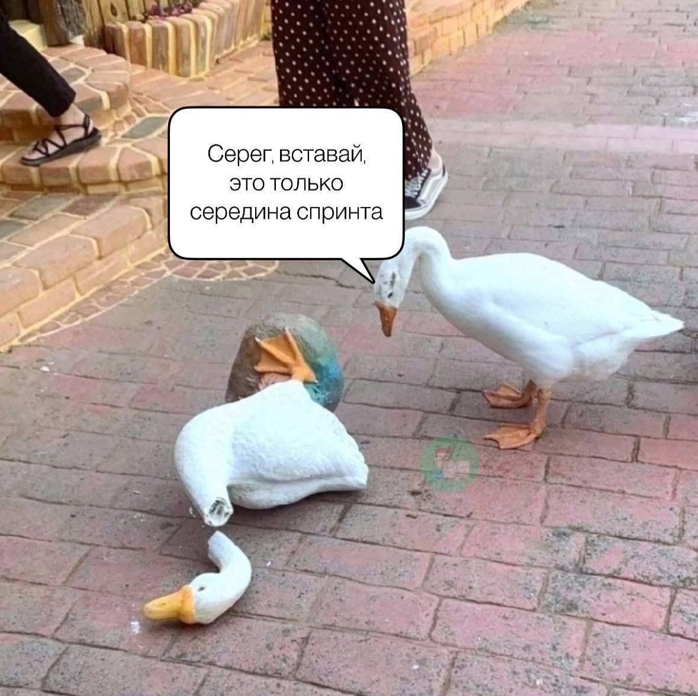
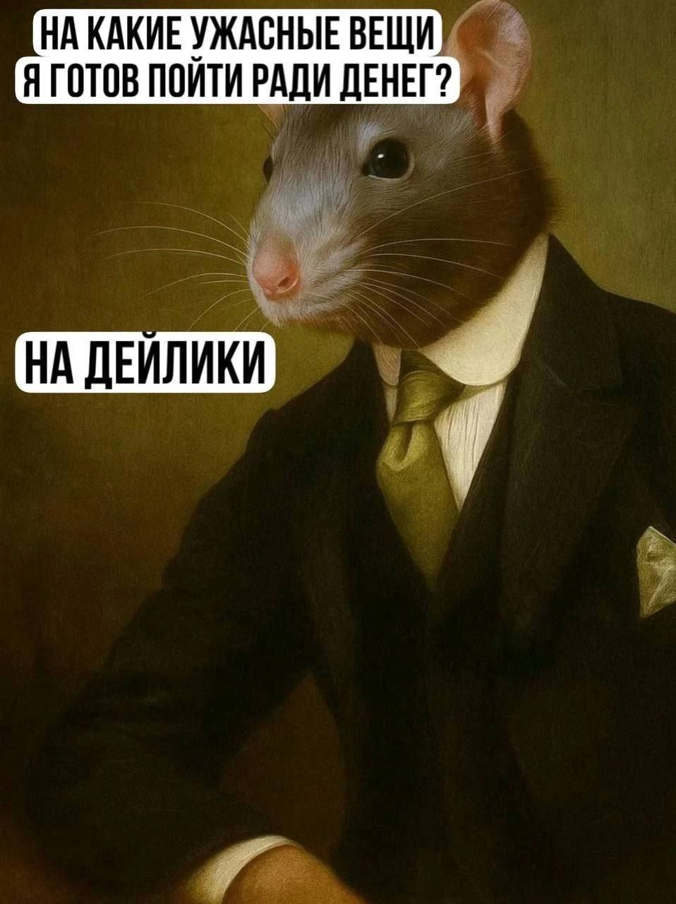
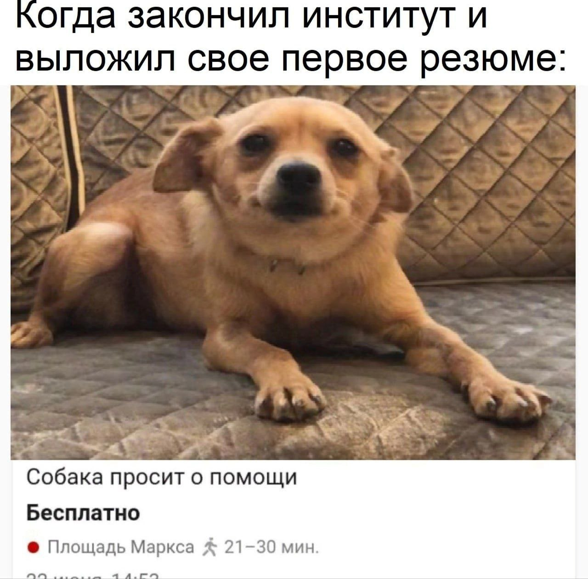

ФИО: Должиков Дмитрий Павлович

Группа: 6403

Научный руководитель: Савельев Д.А.

Тема диплома: "Исследование архитектур нейронных сетей для решения задачи обнаружения и распознавания объектов на цифровых изображениях"

# Лабораторная работа №2 — HTML и CSS

Тема: сайт для трекинга карьеры.

## Структура проекта
```
lab2/
├── index.html              (главная страница)
├── roadmap.html            (страница просмотра роадмапа)
├── my-roadmaps.html        (личные роадмапы)
├── about.html              (о проекте)
├── styles.css              (стили)
└── assets/                 (Фотографии)
    ├── add.svg
    ...
```


> Знаешь самый четкий и ровный формат данных JSON? В честь меня назвали
>
> — Джейсон Стетхем

<video width="720" height="1280" controls>
  <source src="assets/video_2025-10-05_21-19-27.mp4" type="video/mp4">
</video>

<video width="464" height="848" controls>
  <source src="assets/video_2025-10-05_21-30-18.mp4" type="video/mp4">
</video>








